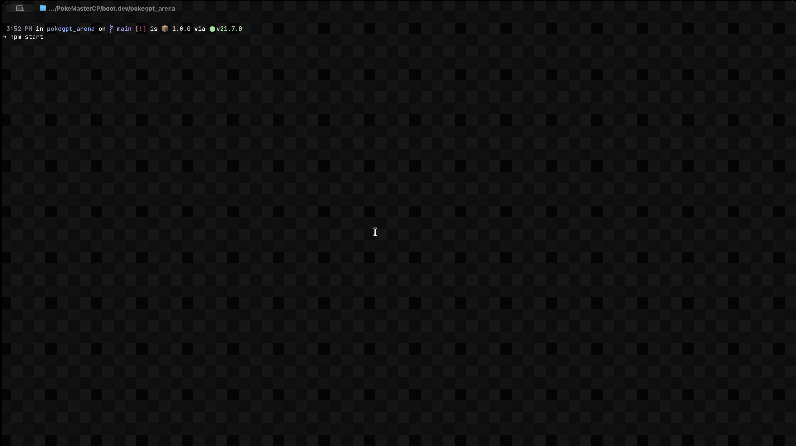

# PokéGPT Arena

A Pokémon battle simulator where two AI models face off against each other using simplified Pokémon battle mechanics. Each AI trainer selects a Pokémon partner and battles turn-by-turn, choosing moves based on type matchups, stat boosts, and battle strategy.



## How It Works

Two AI trainers are initialized via the OpenRouter API. Each trainer is presented with a random selection of 8 Pokémon from the available roster and must choose one as their battle partner. Once both trainers have chosen, the battle begins and they take turns selecting moves until one Pokémon faints.

AI responses are enforced as JSON via OpenAI's structured output schema, ensuring the models always return a valid move or Pokémon choice.

## Simplified Battle Mechanics

This project implements a streamlined version of the Pokémon battle system. Key simplifications include:

- **No abilities or held items** — battles focus purely on stats, types, and moves.
- **No accuracy/evasion system** — all moves always hit.
- **No status conditions** (burn, paralysis, etc.) — the only "status" is the resting mechanic used by recharge moves and Rest.
- **Flat stat boosts** — instead of the official stage-based system (+1, +2, etc.), stat changes are applied as flat percentages of the base stat (50% for standard boosts, 100% for sharp boosts), capped at 4x the base value and floored at 25% of the base value.
- **Single Pokémon per side** — no switching, no team of six. Each trainer picks one partner for the whole battle.
- **Level 50 scaling** — all Pokémon stats are scaled to level 50 using the standard formula.

### Damage Formula

```
Base = floor((22 * MovePower * StatRatio) / 50) + 2
```

The base damage is then modified in order by: critical hit (1/24 chance, 1.5x), random roll (0.85-1.00), STAB (1.5x if the move type matches the user's type), and type effectiveness (checked against both of the target's types).

### Special Move Effects

- **Recharge moves** (Giga Impact, Hyper Beam, etc.) force the user to skip their next turn.
- **Rest** fully heals HP but costs two turns.
- **Lifesteal moves** (Giga Drain, Drain Punch, Leech Life, Horn Leech) heal the user for 50% of damage dealt.
- **Recoil moves** (Flare Blitz, Brave Bird, Wild Charge) deal a percentage of damage back to the user, but cannot KO them.
- **Stat-dropping moves** (Close Combat, Draco Meteor) lower the user's own stats after dealing damage.

## Available Content

- **35 Pokémon**, each with a curated moveset of 4 moves
- **80 moves** total (67 damaging, 13 status/setup)
- **Full type effectiveness chart** covering all 18 types

## Tech Stack

- **Runtime**: Node.js (ES modules)
- **AI**: OpenAI SDK via OpenRouter
- **Data**: PokéAPI for base stats and types
- **Testing**: Vitest

## Getting Started

1. Clone the repo
2. Run `npm install`
3. Create a `.env` file with your OpenRouter API key
4. Run `npm start` to watch a battle unfold

## Running Tests

```
npm test
```
